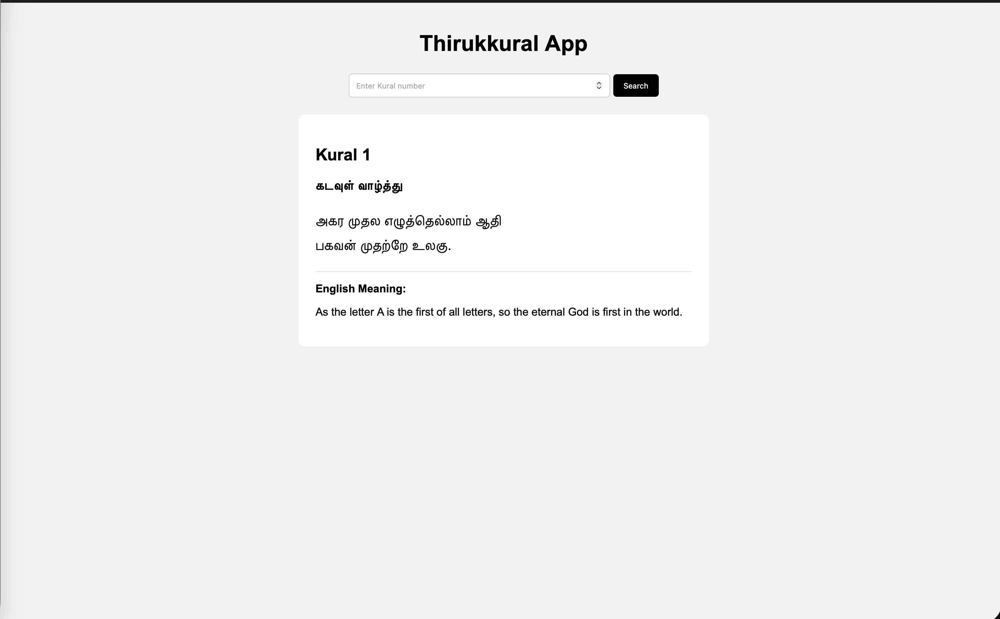

# Thirukkural App

A simple Flask web application that displays Thirukkural verses using a Kural number.

## Features

- Enter a Kural number.
- Fetch the corresponding Thirukkural from an API.
- Display the Tamil Kural and its meaning.

## Project Structure

```text
thirukkural-app/
├── app.py
├── README.md
├── templates/
└── static/
├── homepage.png
```
## Screenshot



## Run Locally

Clone the repository:

```bash
git clone <repository-url>
cd thirukkural-app
```

Create and activate a virtual environment:

```bash
python3 -m venv venv
source venv/bin/activate
```

Install dependencies:

```bash
pip install flask requests
```

Run the application:

```bash
python app.py
```

Open:

```text
http://127.0.0.1:5000
```

## How It Works

```text
User
 ↓
Flask App
 ↓
Thirukkural API
 ↓
JSON Response
 ↓
HTML Template
 ↓
Kural Display
```

The user provides a Kural number. Flask sends a request to the API, receives the Kural data, and passes it to the HTML template for display.

## Built With

- Python
- Flask
- HTML
- CSS
- REST API

## Author

Mrudul P Manesh
